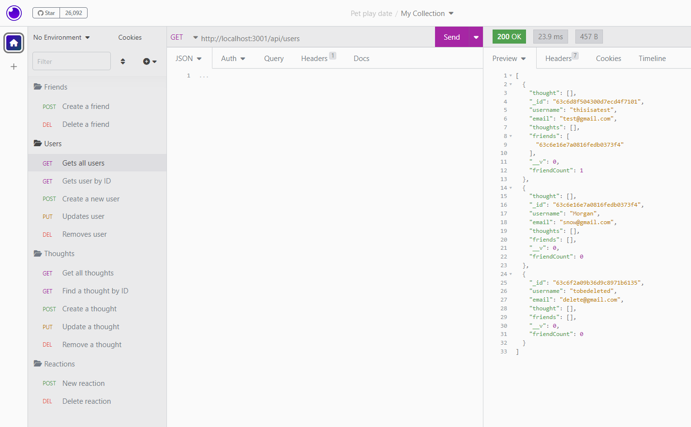

# Social Network API

## Description

The motivation and purpose behind this project was to create a social media network through Insomnia. It solves the problem of not having a place where users can create profiles, as well as create, comment, and react to posts. I learned a lot about using Moment to create timestamps, as well as using MongoDB to create and test connections to databases.

## Table of Contents

- [Installation](#installation)
- [Usage](#usage)
- [Credits](#credits)
- [License](#license)

## Installation

The user must have MongoDB, Node.js, and Insomnia installed. A list of the dependencies needed will be the [credits](#credits) section. If a user already has this repo cloned they can just do `npm install` to get all the dependencies.

## Usage

Walk-through video: [here]()

 

## Credits

[Express 4.18.2](https://www.npmjs.com/package/express)

[Mongoose 6.8.4](https://www.npmjs.com/package/mongoose)

[Moment 2.29.4](https://www.npmjs.com/package/moment)

[Nodemon 2.0.20](https://www.npmjs.com/package/nodemon)

## License

MIT License

A short and simple permissive license with conditions only requiring preservation of copyright and license notices. Licensed works, modifications, and larger works may be distributed under different terms and without source code.